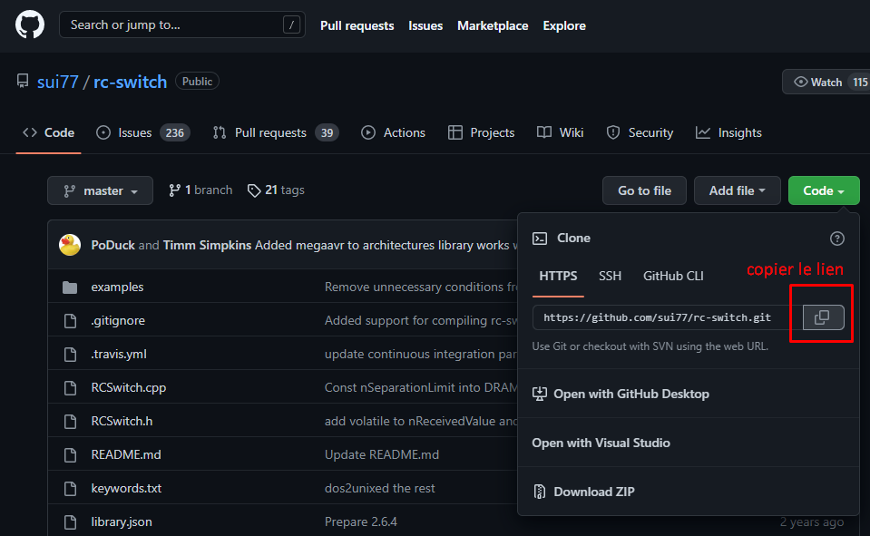
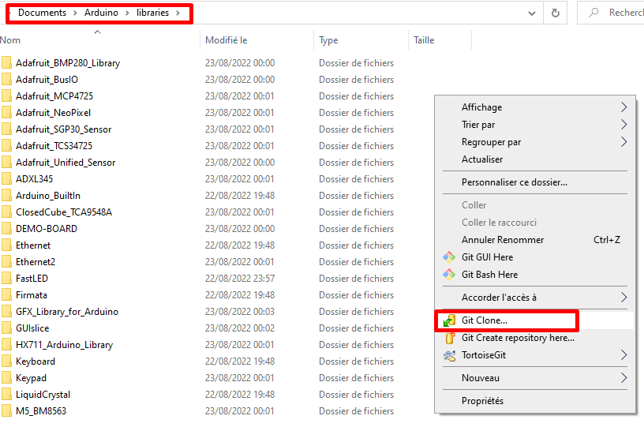
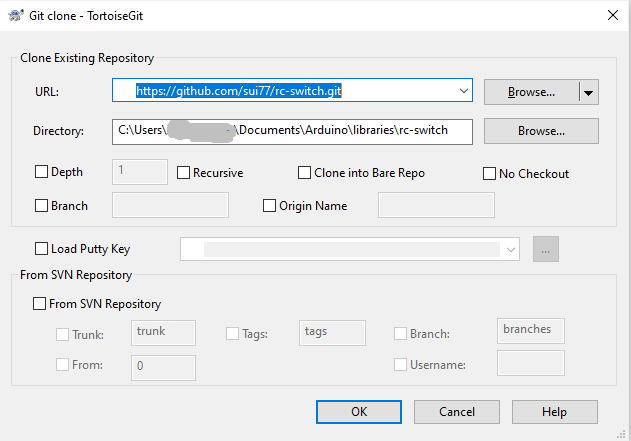
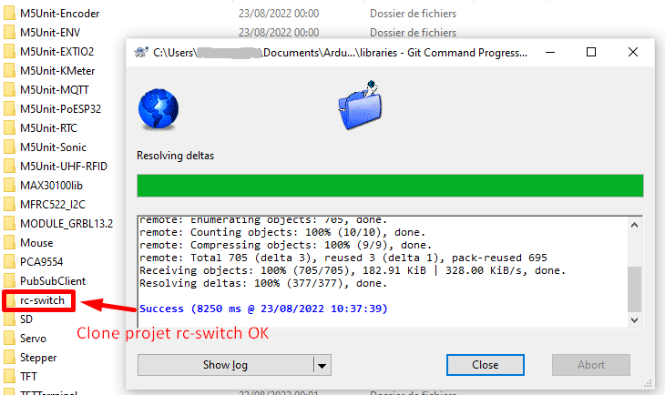

# arduino_esp32_m5atom_RF433

**__________________________ DEBUT SOMMAIRE _____________________________**

* [Librairie necessaire](#arduino_librairie)
* [Cablage](#Cablage)
* [Fonctionnement du logiciel](#fonctionnement)

**___________________________ FIN SOMMAIRE ______________________________**

**_______________________ LIBRAIRE ARDUINO _________________________**

# <a id="arduino_librairie">Libraire arduino necessaire</a>

## Ajout manuel sur un depot github

Voici les taches à effectuer pour ajouter une librairie non disponible dans les dépots Arduino :
 1. Reperer le lien github d'une libraire Arduino
 2. Copier le lien git
 
 3. ouvrir le repertoire "librairie" d'arduino localisation standard : C:\Users\<utilisateur>\Documents\Arduino\libraries
 4. clique droit sur la souris et choisir "Git clone" (git et tortoise git doivent etre installer)
 
 5. Cliquer sur OK de la fentre de clonage de tortoise git
  
 6. Voila la librairie est ajoutée à arduino.
   
 7. Note importante : pour la prise en compte d'ajout manuel de depot dans la librairie, il faut redemarrer arduino.
